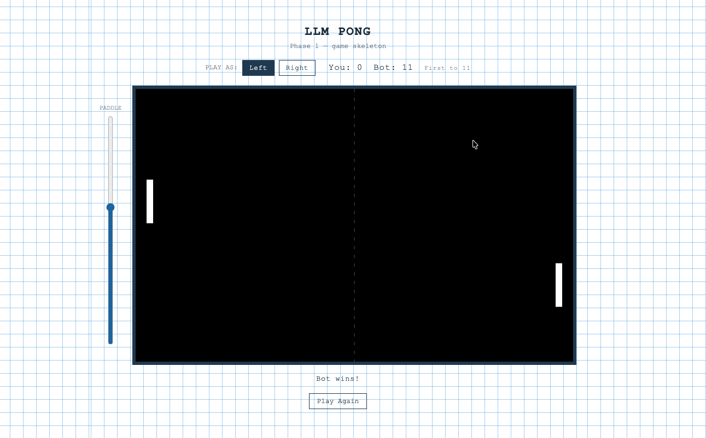
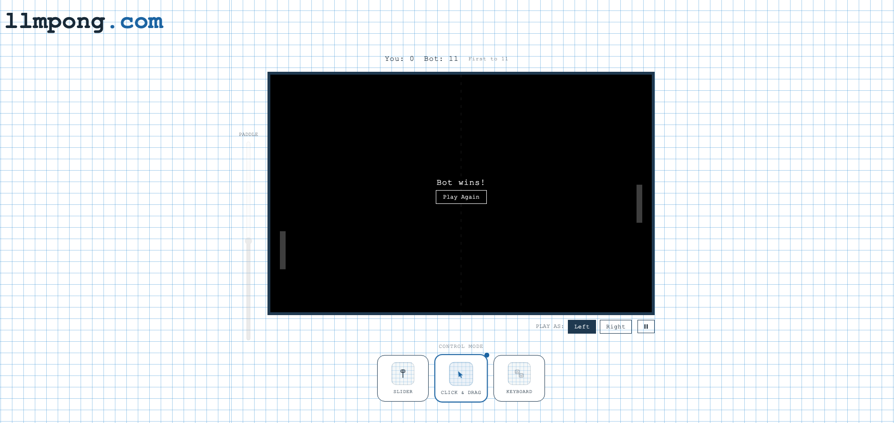

# LLM Pong

A browser-based Pong game that a human plays against a bot, built as the
foundation for a longer experiment: layering a **locally-hosted LLM** on top of
live gameplay so the machine can watch how you play and respond to it — adaptive
difficulty, running commentary, and shifts in strategy driven by your real
measured behaviour rather than scripted rules.

The game is being built in deliberate, self-contained phases. Each phase is small,
reviewed, and dependency-free until its complexity actually justifies new tooling.

---

## Vision

The end state is a web-facing Pong match where:

- A human plays against a bot paddle.
- Player metrics are measured every frame — reaction time, positional accuracy,
  miss streaks, movement patterns, paddle velocity.
- A local LLM (Ollama on a home server, `akd-server1`, running `qwen2.5:3b` /
  `qwen2.5:7b`) consumes those metrics live and produces adaptive commentary and
  strategy — reacting to *how* you play, not just the score.
- The bot's difficulty adapts to keep matches competitive.

None of the LLM or metrics layers exist yet. What exists today is the game
skeleton every later phase attaches to.

---

## Current status — Phase 1 complete: game skeleton

A single self-contained [`index.html`](index.html): HTML + CSS + JS, no build
step, no server, no dependencies. Open it in a browser and play.


*First playable iteration: slider-only control, centered title.*


*Phase 1 as shipped: three control modes, pause, game-over overlay, `llmpong.com` wordmark.*

What Phase 1 delivers:

- **Canvas Pong** — ball physics, wall and paddle bounces, angle-off-paddle
  control, gradual ball speed-up per rally, first-to-11 win condition, a
  game-over overlay with a "Play Again" reset.
- **Three player-paddle control modes**, switchable live from the mode picker:
  - **Slider** — an external vertical slider outside the game window sets an
    **absolute** paddle position (not velocity).
  - **Click & drag** — grab the paddle directly on the playfield (mouse or touch).
  - **Keyboard** — arrow keys / `W`·`S` drive the paddle at a fixed speed.

  Whichever mode is active, the player paddle's position for the frame is
  resolved in a single spot in the game loop, so paddle velocity
  `(y - prevY) / dt` can be derived later without rework.
- **Side selection** — play as the left or right paddle; the slider moves to the
  matching side.
- **Pause** — a pause button beside the side toggle, or double-click the
  playfield; a pulsing "Paused" overlay while held. Disabled once the game is won.
- **Bot paddle** — a fixed heuristic: track the ball's y-position, move toward it,
  capped at a max speed. No adaptation, no metrics, no difficulty tuning.
- **Blueprint visual design** — architectural-drafting-paper grid background, a
  centered bordered game window, black playfield with white paddles and ball, and
  an `llmpong.com` wordmark top-left.

### Running it

Open [`index.html`](index.html) directly in any modern browser. No install, no
server. Pick a side, choose a control mode, first to 11 wins.

---

## Roadmap

| Phase | Focus | Adds |
|-------|-------|------|
| **1** ✅ | Game skeleton | Canvas Pong, three control modes (slider / click & drag / keyboard), side selection, pause, game-over overlay, heuristic bot, blueprint styling + wordmark |
| **2** | Metrics | Per-frame capture of reaction time, positional accuracy, miss streaks, movement patterns, paddle velocity — recorded, not yet acted on. Likely the point TypeScript is reconsidered as game state grows. |
| **3** | Adaptive bot | Rule-based difficulty adjustment driven by Phase 2 metrics — bot speed, tracking error, and anticipation tuned to keep matches close. |
| **4** | LLM layer | Ollama integration on `akd-server1`. Live metrics summarised and sent to `qwen2.5`; model returns commentary and strategy hints. Request/response shapes defined here. |
| **5** | Web frontend & deploy | Hosting, the surrounding site (landing, sign-up, dashboards), accounts/sessions. Point Tailwind is reconsidered if UI grows past the game window. |

Each phase gets its own handoff spec before implementation begins.

---

## Tech stack

Plain HTML / CSS / JS for Phase 1 — chosen because it needs no build pipeline,
opens directly in a browser, and matches the project's preference for small,
confirmed, dependency-free steps before adding tooling the code's complexity
doesn't yet justify.

- **TypeScript** — deferred. Real value once game state gets complex (Phase 2+
  metrics objects, Phase 3 bot-parameter structs, Phase 4 LLM message shapes), but
  it needs a build step. Reconsider at Phase 2–3.
- **Tailwind** — deferred. Most useful across many UI elements sharing a spacing
  and colour system. Phase 1's styling is compact enough that hand-written CSS is
  simpler. Reconsider at Phase 5 if the frontend grows beyond the game window.

---

## Repository layout

```
llm_pong/
├── index.html                          Phase 1 game — the whole thing
├── images/
│   └── screenshots/
│       └── phase-1/
│           ├── gameplay.png            first playable iteration
│           └── phase_1_complete.png    Phase 1 as shipped
├── README.md
└── LICENSE
```

`images/` holds all public and project-facing images; screenshots are grouped by
phase under `images/screenshots/`.
